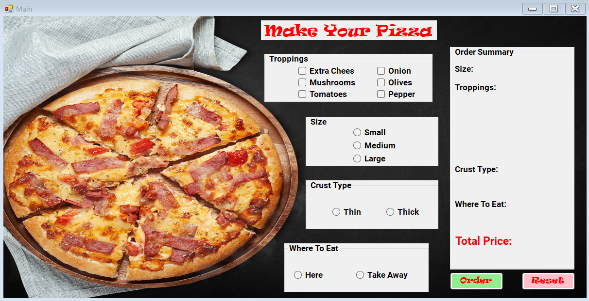
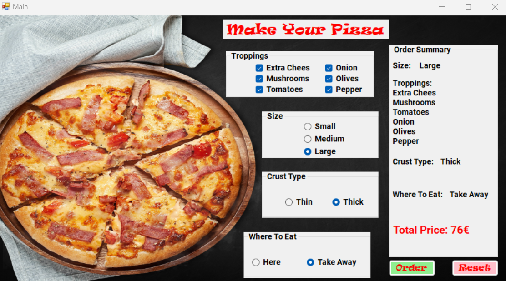

# MakeUrPizza

A Windows Forms application for customizing and ordering pizza. Select size, crust type, toppings, and dining option. Real-time price updates and easy order reset/confirmation. Perfect for learning event-driven programming in C# and building user-friendly WinForms interfaces.

<p align="center">
  
  
</p>

## Features

- Select pizza size (Small, Medium, Large)
- Choose crust type (Thin, Thick)
- Add various toppings (Extra Cheese, Mushrooms, Tomatoes, Onion, Olives, Pepper)
- Choose dining option (Here, Take Away)
- Real-time total price calculation
- Reset order to default settings
- Confirm order with a pop-up message

## Installation

1. Clone the repository:
```sh
git clone https://github.com/EngenMe/MakeUrPizza.git
```

2. Open the project in Visual Studio.
3. Build and run the application.

## Usage

1. Run the application.
2. Select the desired pizza size, crust type, toppings, and dining option.
3. View the total price as you make your selections.
4. Click the "Order" button to confirm your order.
5. Click the "Reset" button to reset all selections to default.

## License

This project is licensed under the MIT License. See the LICENSE file for details.

## Contributing

Contributions are welcome! Please feel free to submit a Pull Request.
